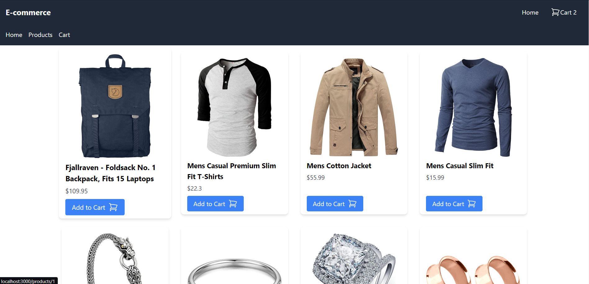

# E-commerce Platform

This is a dynamic, responsive e-commerce platform built with React.js and Tailwind CSS, featuring reusable components, state management with Redux, responsive design, and Progressive Web App (PWA) capabilities.

# Screenshots


## Live link

[Click here]()

## Features

- **Reusable Components:** Header, Footer, Product Card, Navigation Menu
- **State Management:** Global state handling using Redux Toolkit
- **Responsive Design:** Fully responsive across different devices and screen sizes using Tailwind CSS
- **PWA Implementation:** Service workers for offline capabilities, Web App Manifest, and HTTPS
- **Product Listing:** Fetches data from a mock API and displays products
- **Product Detail Page:** Detailed view of products
- **Shopping Cart:** Add items to the cart and view cart contents

## Installation

```sh
   git clone https://github.com/sac1010/ecommerce-platform.git
   cd ecommerce-platform
   npm install
   npm start

```

## Reusable Components
- Header
The header component with the website logo and title.

-  Footer
The footer component with basic footer content.

- NavigationMenu
The navigation menu for easy navigation between different pages.

- ProductCard
Displays a product with image, title, price, and an "Add to Cart" button.


## State Management
- Redux Toolkit
- Used for handling global state such as the shopping cart. The cartSlice.js file contains the reducer and actions for the cart functionality.

## Responsive Design
- Tailwind CSS is used for styling and ensuring the application is fully responsive across different devices and screen sizes.

## PWA Implementation
Service Worker
A service worker is registered to enable offline capabilities. The service-worker.js file contains the logic for caching and serving the app shell and content.

## Additional Features
- Product Listing Page
  Fetches products from https://fakestoreapi.com/products and displays them in a grid layout.

- Product Detail Page
Displays detailed information about a product when clicked.

- Shopping Cart
Allows adding items to the cart and viewing the cart contents.


